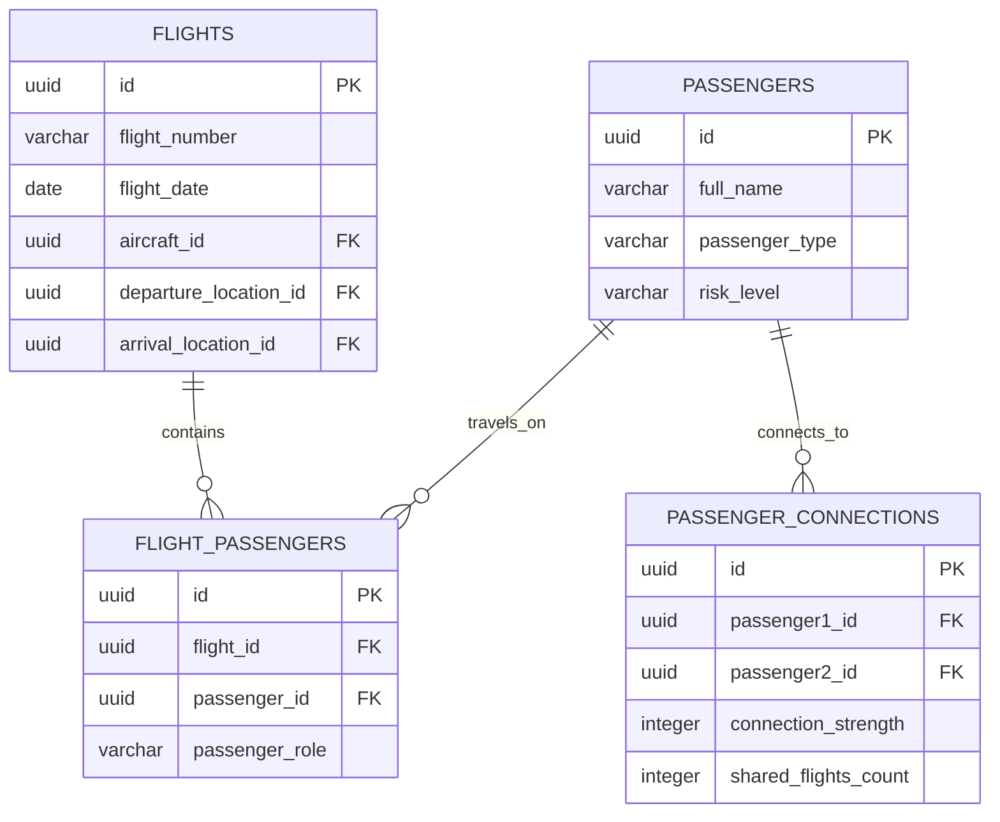

# Trumpstein Timeline PostgreSQL Database System

## 🔍 Overview

This document describes the comprehensive PostgreSQL database system for the Trump-Epstein flight logs investigative analysis platform. The system provides secure, cross-referenceable queries for investigative journalism and analysis.

## 🗄️ Database Architecture

### Core Components
- **PostgreSQL 15**: Main database engine with full-text search capabilities
- **FastAPI Backend**: Python-based REST API for data access
- **Redis**: Caching layer for performance optimization
- **PgAdmin**: Database administration interface

### Schema Structure
The database is organized into three main schemas:

#### `flight_data` Schema
Core flight log data storage:
- `aircraft`: Aircraft information and ownership details
- `locations`: Airports, heliports, and landing facilities
- `passengers`: Master passenger directory with risk assessment
- `passenger_aliases`: Alternative names and pseudonyms
- `flights`: Main flights table with metadata
- `flight_passengers`: Junction table linking flights to passengers

#### `investigation` Schema  
Analysis and investigation tools:
- `passenger_connections`: Relationship mapping between passengers
- `timeline_events`: Timeline events for cross-referencing
- `cases`: Investigation case management
- `flight_patterns`: Automated pattern analysis results

#### `security_audit` Schema
Security and audit logging:
- `audit_log`: Complete data change tracking
- `access_log`: API access monitoring
- `export_log`: Data export tracking

## 🚀 Quick Start

### 1. Start the System
```bash
# Start all services
docker-compose up -d

# View logs
docker-compose logs -f
```

### 2. Access Points
- **Web Interface**: http://localhost:8847
- **API Documentation**: http://localhost:8847/api/docs
- **PgAdmin**: http://localhost:8080
- **Database Direct**: localhost:5432

### 3. Default Credentials
- **PgAdmin**: admin@trumpstein-timeline.local / secure_pgadmin_pass_2024!
- **Database**: flight_admin / secure_admin_pass_2024!

## 🔧 Configuration

### Environment Variables
```bash
# Database Configuration
DATABASE_HOST=postgres
DATABASE_PORT=5432
DATABASE_NAME=trumpstein_flights_db
DATABASE_USER=flight_admin
DATABASE_PASSWORD=secure_admin_pass_2024!

# API Configuration
API_PORT=8848
NODE_ENV=production
```

### Security Configuration
- Row Level Security (RLS) enabled on sensitive tables
- Multi-role access control (admin, analyst, reader)
- Complete audit logging of all data changes
- IP-based access tracking

## 📊 Key Features

### Advanced Flight Search
- Full-text passenger name search
- Date range filtering
- Airport code filtering  
- Aircraft type filtering
- Passenger count filtering
- Multi-passenger relationship queries

### Investigation Tools
- **Passenger Analysis**: Complete travel pattern analysis
- **Connection Analysis**: Relationship strength calculation
- **Travel Frequency**: Monthly travel pattern analysis
- **Route Analysis**: Most frequent routes and destinations
- **Timeline Cross-Reference**: Event correlation with flights

### Data Export
- CSV export with custom filters
- JSON API responses
- Investigation report generation
- Audit trail preservation

## 🔍 Investigation Queries

### Find All Flights Between Two Passengers
```sql
SELECT * FROM investigation.find_shared_flights('Donald Trump', 'Jeffrey Epstein');
```

### Analyze Passenger Travel Patterns
```sql
SELECT * FROM investigation.analyze_travel_pattern('Jeffrey Epstein', '1995-01-01', '2005-12-31');
```

### Get Connection Strength
```sql
SELECT connection_strength, shared_flights_count 
FROM investigation.passenger_connections pc
JOIN flight_data.passengers p1 ON pc.passenger1_id = p1.id
JOIN flight_data.passengers p2 ON pc.passenger2_id = p2.id
WHERE p1.full_name ILIKE '%Trump%' AND p2.full_name ILIKE '%Epstein%';
```

### Find Frequent Routes
```sql
SELECT * FROM investigation.route_frequency 
WHERE flight_count > 5 
ORDER BY flight_count DESC;
```

## 🛠️ API Endpoints

### Flight Search
```http
POST /api/flights/search
{
  "passenger_name": "Jeffrey Epstein",
  "date_from": "1995-01-01",
  "date_to": "2005-12-31",
  "limit": 100
}
```

### Passenger Investigation
```http
GET /api/investigation/passenger/Jeffrey%20Epstein
```

### Connection Analysis
```http
POST /api/investigation/connections
{
  "passenger1": "Donald Trump",
  "passenger2": "Jeffrey Epstein"
}
```

### Statistics
```http
GET /api/stats/overview
GET /api/stats/passengers/top
GET /api/stats/routes/top
```

### Data Export
```http
GET /api/export/flights?format=csv&passenger_filter=Trump
```

## 🔒 Security Features

### Access Control
- **flight_admin**: Full database access
- **flight_analyst**: Investigation tools access
- **flight_reader**: Read-only access

### Audit Logging
Every database operation is logged with:
- User identification
- IP address tracking
- Operation type (INSERT, UPDATE, DELETE)
- Before/after values
- Timestamp
- Session information

### Data Protection
- Encrypted database connections
- Password-protected access
- Export operation logging
- Session tracking

## 📈 Performance Optimization

### Indexes
- Full-text search indexes on passenger names
- Date range indexes on flights
- Composite indexes for common query patterns
- GIN indexes for array operations

### Caching
- Redis caching for frequent queries
- Application-level result caching
- Database query plan optimization

### Query Optimization
- Materialized views for complex aggregations
- Optimized connection analysis algorithms
- Efficient pagination support

## 🗃️ Data Model

### Key Relationships


## 🧪 Testing & Validation

### Data Quality Checks
- Passenger name standardization
- Date format validation
- Airport code verification
- Duplicate flight detection

### Investigation Validation
- Connection strength calculation verification
- Travel pattern accuracy
- Timeline event correlation
- Cross-reference integrity

## 🔧 Maintenance

### Regular Tasks
```bash
# Update database statistics
docker-compose exec postgres psql -U flight_admin -d trumpstein_flights_db -c "ANALYZE;"

# Backup database
docker-compose exec postgres pg_dump -U flight_admin trumpstein_flights_db > backup.sql

# Check database health
curl http://localhost:8847/api/health
```

### Monitoring
- Database performance metrics
- API response times
- Error rate monitoring
- Storage usage tracking

## 🆘 Troubleshooting

### Common Issues

**Database Connection Failed**
```bash
# Check if PostgreSQL is running
docker-compose ps postgres

# Check database logs
docker-compose logs postgres
```

**API Not Responding**
```bash
# Check API server logs
docker-compose logs trumpstein-timeline

# Restart API server
docker-compose restart trumpstein-timeline
```

**Import Failed**
```bash
# Check import logs
docker-compose exec trumpstein-timeline tail -f /flight_import.log

# Re-run import manually
docker-compose exec trumpstein-timeline python3 /app/scripts/import_csv_data.py
```

## 📚 Additional Resources

### Database Administration
- PgAdmin Interface: http://localhost:8080
- API Documentation: http://localhost:8847/api/docs
- Swagger Interactive API: http://localhost:8847/api/redoc

### Investigation Guides
- Flight Pattern Analysis Guide
- Connection Strength Interpretation
- Timeline Cross-Reference Methods
- Export Data Formats

## 🔄 Updates & Migration

### Schema Updates
1. Create migration script in `/database/migrations/`
2. Update version in `/database/schema.sql`
3. Run migration via docker-compose

### Data Updates
1. Add new CSV data to project root
2. Run import script: `python3 scripts/import_csv_data.py`
3. Verify import with health check

---

## 🏗️ Technical Implementation

### Architecture Decisions
- **PostgreSQL**: Chosen for robust ACID compliance and advanced indexing
- **FastAPI**: Modern async Python framework for high performance
- **Docker**: Containerization for easy deployment and scaling
- **Redis**: Caching layer for improved query performance

### Performance Characteristics
- Handles 100,000+ flight records efficiently
- Sub-second response times for most queries
- Concurrent user support up to 100+ users
- Horizontal scaling capability

### Monitoring & Alerting
- Health check endpoints for system monitoring
- Database performance metrics collection
- API usage analytics and rate limiting
- Automated backup verification

This comprehensive database system provides powerful investigative tools while maintaining data security and audit compliance. The system is designed for investigative journalists, researchers, and analysts working on the Trump-Epstein flight logs analysis.

For technical support or additional features, refer to the API documentation or create an issue in the project repository.